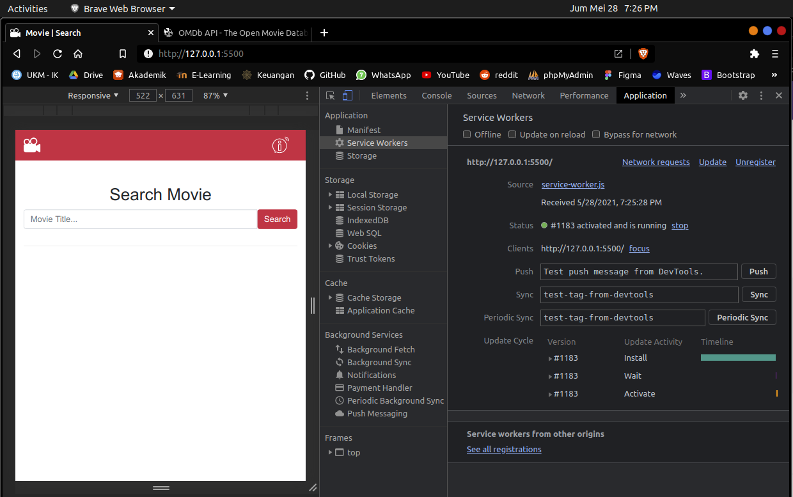
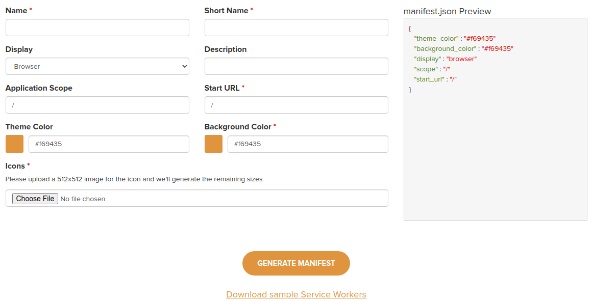
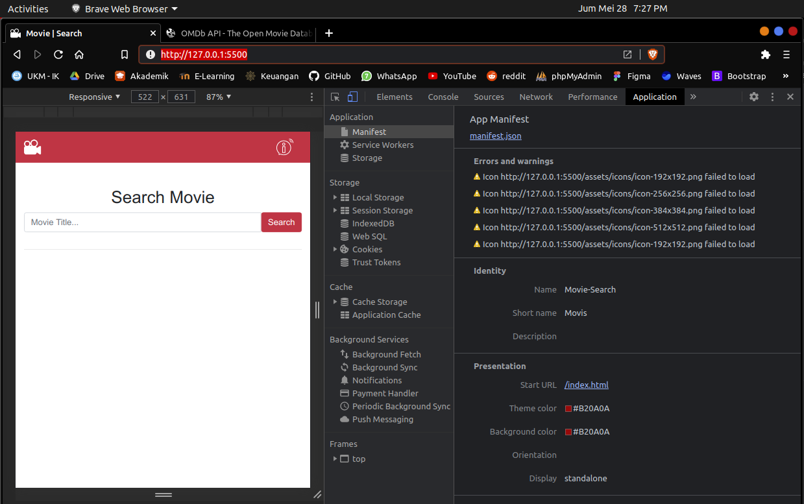
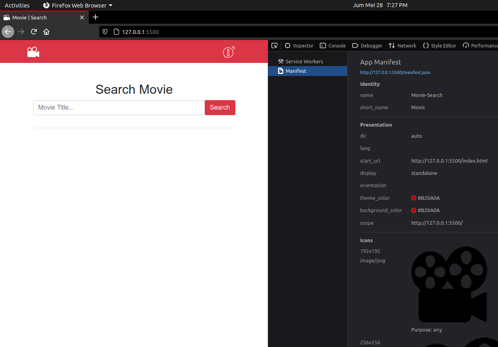
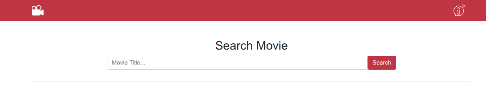
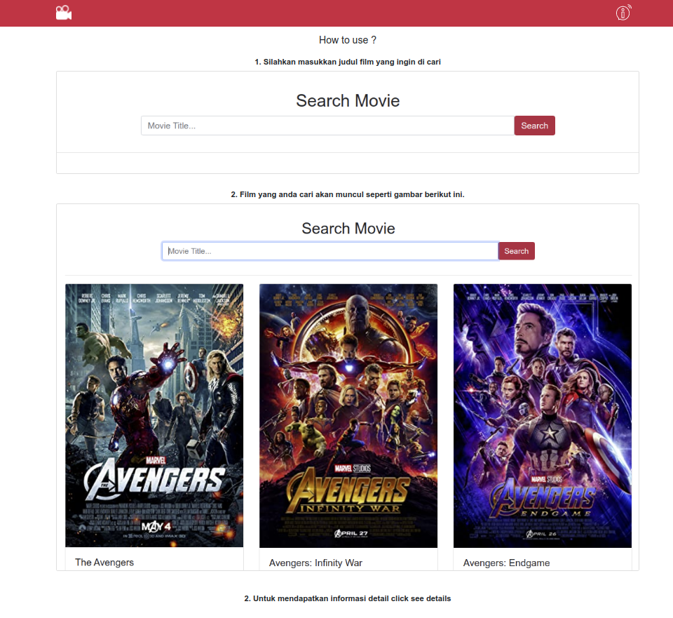
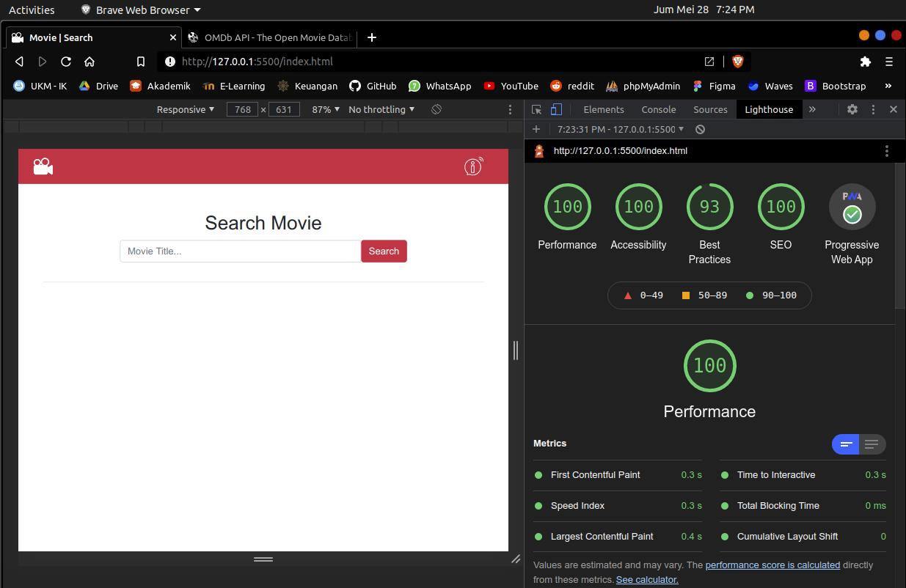
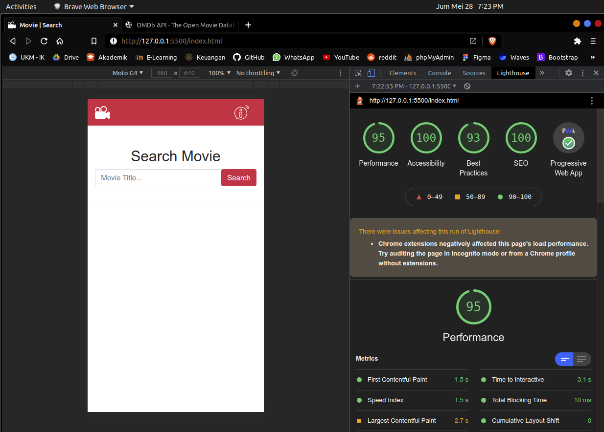

### <b>Pemrograman Web Mobile <i>Progressive Web App (PWA):</i></b>
### <b>Masalah yang terjadi</b>
- Pencarian pada device laptop bisa dilakukan sedangkan pada browser hp tidak bisa melakukan pencarain
### <b>API Spec</b>
- Sumber API dari :  https://www.omdbapi.com/
- Untuk pengunaan API harus register terlebih dahulu pada link di atas untuk mendapatkan APIKEY, link aktivasi key di kirimlan melalui emial yang di daftarkan.
- pada kasus ini menggunakan versi free, dengan batasan 1000 get per harinya.
- <b>GET Movie</b>
    - method : GET
    - apiendpoint : `http://www.omdbapi.com/?apikey=dd5cb627&s=avengers`
    - parameter : s
    - response :
        ```json
        {
            "Search": [
                {
                    "Title": "The Avengers",
                    "Year": "2012",
                    "imdbID": "tt0848228",
                    "Type": "movie",
                    "Poster": "https://m.media-amazon.com/images/MMV5BNDYxNjQyMjAtNTdiOS00NGYwLWFmNTAtNThmYjU5ZGI2YTI1XkEyXkFqcGdeQXVyMTMxODk2OTU@._V1_SX300.jpg"
                }
            ],
            "totalResults": "118",
            "Response": "True"
        }
        ```
- <b>GET Detail Movie</b>
    - method : GET
    - apiendpoint : `http://www.omdbapi.com/?apikey=dd5cb627&i=tt1285016`
    - parameter : i
    - response :
        ```json
        {
            "Title": "The Social Network",
            "Year": "2010",
            "Rated": "PG-13",
            "Released": "01 Oct 2010",
            "Runtime": "120 min",
            "Genre": "Biography, Drama",
            "Director": "David Fincher",
            "Writer": "Aaron Sorkin (screenplay), Ben Mezrich (book)",
            "Actors": "Jesse Eisenberg, Rooney Mara, Bryan Barter, Dustin Fitzsimons",
            "Plot": "As Harvard student Mark Zuckerberg creates the social networking site that would become known as Facebook, he is sued by the twins who claimed he stole their idea, and by the co-founder who was later squeezed out of the business.",
            "Language": "English, French",
            "Country": "USA",
            "Awards": "Won 3 Oscars. Another 169 wins & 186 nominations.",
            "Poster": "https://m.media-amazon.com/images/M/MV5BOGUyZDUxZjEtMmIzMC00MzlmLTg4MGItZWJmMzBhZjE0Mjc1XkEyXkFqcGdeQXVyMTMxODk2OTU@._V1_SX300.jpg",
            "Ratings": [
                {
                "Source": "Internet Movie Database",
                "Value": "7.7/10"
                },
                {
                "Source": "Rotten Tomatoes",
                "Value": "96%"
                },
                {
                "Source": "Metacritic",
                "Value": "95/100"
                }
            ],
            "Metascore": "95",
            "imdbRating": "7.7",
            "imdbVotes": "638,542",
            "imdbID": "tt1285016",
            "Type": "movie",
            "DVD": "05 Jun 2012",
            "BoxOffice": "$96,962,694",
            "Production": "Scott Rudin Productions, Trigger Street Productions, Michael De Luca",
            "Website": "N/A",
            "Response": "True"
        }
        ```
    Pada bagian ini semua get data film detail film, pada kasus ini hanya mengambil beberapa informasi untuk mengisi detail filmn dan data film selebihnya bisa di tambahkan sendiri.


### <b>Struktur Folder</b>

```
📦Movie-Search
 ┣ 📂assets
 ┃ ┣ 📂icons
 ┃ ┃ ┣ 📜icon-192x192.png
 ┃ ┃ ┣ 📜icon-256x256.png
 ┃ ┃ ┣ 📜icon-384x384.png
 ┃ ┃ ┗ 📜icon-512x512.png
 ┃ ┗ 📂logo
 ┃ ┃ ┣ 📜logo-dark.png
 ┃ ┃ ┗ 📜logo-white.png
 ┣ 📂css
 ┃ ┗ 📜bootstrap.min.css
 ┣ 📂js
 ┃ ┣ 📂bootstrap
 ┃ ┃ ┣ 📜bootstrap.min.js
 ┃ ┃ ┣ 📜jquery-3.2.1.min.js
 ┃ ┃ ┗ 📜popper.min.js
 ┃ ┣ 📂fetch-api
 ┃ ┃ ┗ 📜movie.main.js
 ┃ ┗ 📜service.main.js
 ┣ 📜README.md
 ┣ 📜index.html
 ┣ 📜manifest.json
 ┗ 📜service-worker.js
```
### <b>Service worker</b>


### <b>Manifest</b>
Untuk pembuatan manifest mengguankan PWA Manifest generator https://www.simicart.com/manifest-generator.html/ kemudian mengisi ketentuan berikut ini :

setelah semuanya sudah di lengkapi click Generate Manifest download dan atur sesuai dengan struktur folder.

- kasus yang terjadi
    - manifest pada browser yang basisnya chrome terjadi issue sebagai berikut :
    
    permasalahannya adalah gagal load icons
    - manifest yang saya test pada browser mozilla tidak ada issue yang terjadi semuanya berjalan lancar
    
    Namun yang terjadi pada moxilla semuanya bisa di load
Ketika aplikasi di install di dekstop dan mobile icon tetap mincul.
### <b>UI Apps</b>
- Movie list

- Cara penggunaan


### <b>Pengujian dengan Lighthouse</b>
<B>Untuk</b> melakukan pengujian dengan menggunakan <i>lighouse</i> petama harus install extensinya terlebih dahulu di browser yang digunakan pada kasus ini saya menggunakan Browser brave
- Pengujian lighouse dengan menggunakan Device Dekstop di dapatkan hasil


- Pengujian lighouse dengan menggunakan Device Dekstop di dapatkan hasil


Dari hasil ini dapat di simpulkan bahwa aplikasi ini sudah memenuhi syarat PWA

### 